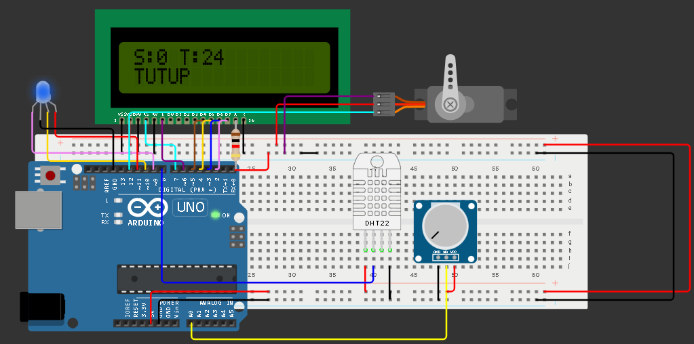
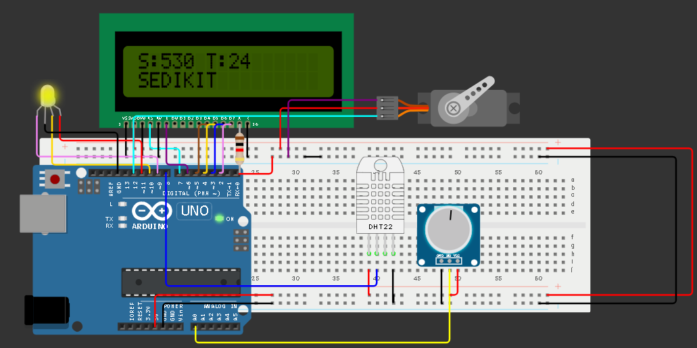
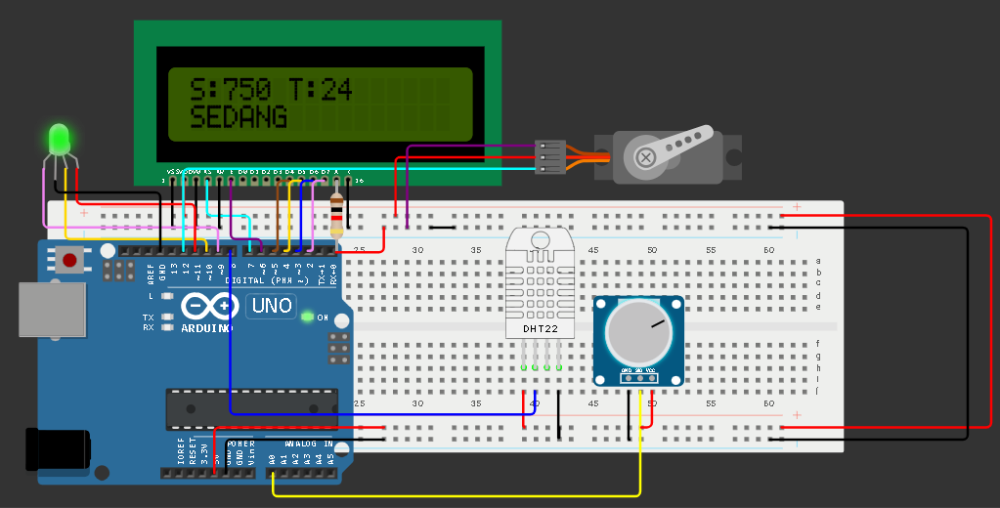
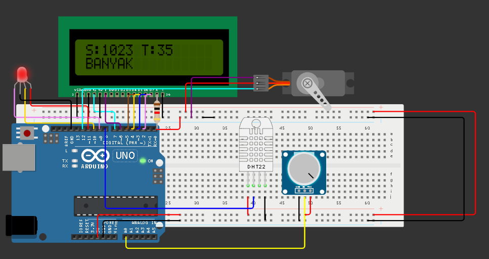

# 🌱 Fuzzy Automatic Irrigation System

Automatic plant watering system using Mamdani Fuzzy Logic.

## 📌 Description

This project implements an automatic irrigation system using fuzzy logic.
The system reads soil moisture and temperature, then determines the watering level automatically.

## ⚙️ Components

* Arduino Uno
* DHT22 Temperature Sensor
* Potentiometer (Soil Moisture Simulation)
* Servo Motor
* LCD 16x2
* RGB LED
* Resistors
* Breadboard & Jumper Wires

## 🧠 Fuzzy Logic Method

This project uses **Mamdani Fuzzy Inference System** consisting of:

* Fuzzification
* Rule Base
* Inference
* Defuzzification

## Inputs

* Soil Moisture
* Temperature

## Outputs

* Servo Motor (Water Valve)
* RGB LED Indicator
* LCD Display

## 🔄 Fuzzy Rules

* Dry AND Hot → High Watering
* Dry AND Normal → Medium Watering
* Dry AND Cold → Low Watering
* Moist → Low Watering
* Wet → No Watering

## 🧪 Simulation

https://wokwi.com/projects/461809256631429121

## 📷 Preview

## 👨‍💻 Author

Arrio Yazid Busthami
D3 Teknik Komputer - Politeknik Sriwijaya
